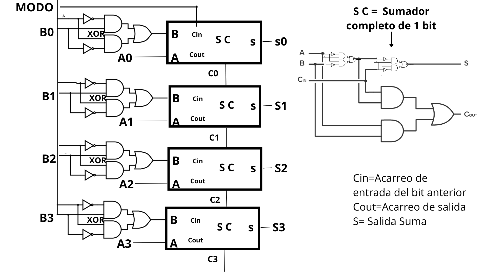

# Sumador / Restador de 4 Bits usando Puertas Lógicas

## Descripción general

Este proyecto implementa un **sumador–restador de 4 bits** utilizando únicamente **puertas lógicas básicas** (AND, OR y NOT).  
A partir de estas puertas se construye la operación XOR, un **sumador completo de 1 bit**, y finalmente un sistema de **4 bits conectado en cascada**.

---

## Objetivos

- Implementar la suma y resta binaria de 4 bits.
- Construir todas las operaciones a partir de puertas lógicas básicas.
- Aplicar el complemento a dos para la resta.
- Validar la implementación mediante pruebas.

---

## Diseño del sistema

### Arquitectura general

El sistema está compuesto por **cuatro sumadores completos de 1 bit (SC)** conectados en cascada, formando un **ripple-carry adder**.

Un *ripple-carry adder* es un tipo de sumador en el cual el **acarreo (carry)** generado en cada bit se propaga al siguiente bit, de manera secuencial.

Cada sumador completo recibe:
- Un bit del operando **A**
- Un bit del operando **B** (posiblemente invertido)
- Un acarreo de entrada (**Cin**)

Y produce:
- Un bit de salida (**S**)
- Un acarreo de salida (**Cout**)

El **Cout** de cada etapa se conecta al **Cin** de la siguiente, permitiendo la propagación del acarreo a lo largo de los 4 bits.

---

### Control de suma y resta

La operación se controla mediante el bit **M (Modo)**:

| M | Operación |
|---|----------|
| 0 | Suma |
| 1 | Resta |

Para la resta se utiliza el **complemento a dos**, basado en la expresión:

A − B = A + (~B + 1)

Esto se logra mediante:
- Una compuerta **XOR** entre cada bit de **B** y el bit **M**, lo que permite invertir B cuando `M = 1`
- La inicialización del acarreo de entrada con el valor de **M**

---

## Diagrama lógico del sistema

El siguiente diagrama muestra el diseño completo del **sumador–restador de 4 bits**, construido a partir de **sumadores completos de 1 bit (SC)** conectados en cascada y controlados por la señal de modo **M**.

- Cada bit del operando **B** se combina con **M** mediante una compuerta XOR.
- El acarreo de salida (**Cout**) de cada SC se conecta al acarreo de entrada (**Cin**) del siguiente.
- El primer **Cin** se inicializa con **M**, permitiendo implementar el complemento a dos en la resta.

<p align="center">
  
</p>

---

### Correspondencia entre diagrama e implementación

| Elemento del diagrama | Implementación en Python |
|----------------------|--------------------------|
| XOR entre B y M | `XOR(B[i], M)` |
| Cin inicial | `acarreo = M` |
| Sumador completo (SC) | `sumador_completo()` |
| Propagación de acarreo | variable `acarreo` |
| Salidas S0–S3 | lista `resultado` |
| Acarreo final C3 | `acarreo` final |


---

## Funcionamiento del código

### Puertas lógicas básicas

Se implementan las puertas **AND**, **OR** y **NOT**, las cuales constituyen la base de todo el sistema.  
No se utilizan operadores aritméticos como `+` o `-`.

---

### Implementación de XOR

La puerta XOR no se usa como operador directo, sino que se construye a partir de AND, OR y NOT:

XOR(A, B) = (A AND NOT B) OR (NOT A AND B)


---

### Sumador completo de 1 bit

El sumador completo recibe tres entradas:
- A
- B
- Cin

Y genera:
- S (bit de suma)
- Cout (acarreo de salida)


---

### Sumador–Restador de 4 bits

Cuatro sumadores completos se conectan en cascada.  
El acarreo generado en cada bit se propaga al siguiente, implementando un **ripple-carry adder**.

El bit de control **M** permite que el sistema funcione como:
- Sumador cuando `M = 0`
- Restador cuando `M = 1`, aplicando complemento a dos

---

## Puertas lógicas implementadas

### Tabla de verdad – AND
| A | B | AND |
|---|---|-----|
| 0 | 0 | 0 |
| 0 | 1 | 0 |
| 1 | 0 | 0 |
| 1 | 1 | 1 |

### Tabla de verdad – OR
| A | B | OR |
|---|---|----|
| 0 | 0 | 0 |
| 0 | 1 | 1 |
| 1 | 0 | 1 |
| 1 | 1 | 1 |

### Tabla de verdad – NOT
| A | NOT(A) |
|---|--------|
| 0 | 1 |
| 1 | 0 |

### Tabla de verdad – XOR
| A | B | XOR |
|---|---|-----|
| 0 | 0 | 0 |
| 0 | 1 | 1 |
| 1 | 0 | 1 |
| 1 | 1 | 0 |

---

## Sumador completo de 1 bit

### Tabla de verdad

| A | B | Cin | S | Cout |
|---|---|-----|---|------|
| 0 | 0 | 0 | 0 | 0 |
| 0 | 0 | 1 | 1 | 0 |
| 0 | 1 | 0 | 1 | 0 |
| 0 | 1 | 1 | 0 | 1 |
| 1 | 0 | 0 | 1 | 0 |
| 1 | 0 | 1 | 0 | 1 |
| 1 | 1 | 0 | 0 | 1 |
| 1 | 1 | 1 | 1 | 1 |

---

## Pruebas y validación

### Herramienta utilizada
Se utilizó el módulo **unittest** de Python.

-Facilita la validación progresiva del sistema, desde las puertas lógicas básicas hasta el sumador–restador completo.
- Reemplaza la necesidad de verificar manualmente grandes tablas de verdad, reduciendo errores humanos.

### Pruebas realizadas
- Puertas lógicas AND, OR y NOT
- Puerta XOR construida con puertas básicas
- Sumador completo de 1 bit
- Sumador de 4 bits (modo suma)
- Restador de 4 bits (modo resta)

### Resultados

Al ejecutar:

```bash
python Tests.py
El sistema devuelve:

OK